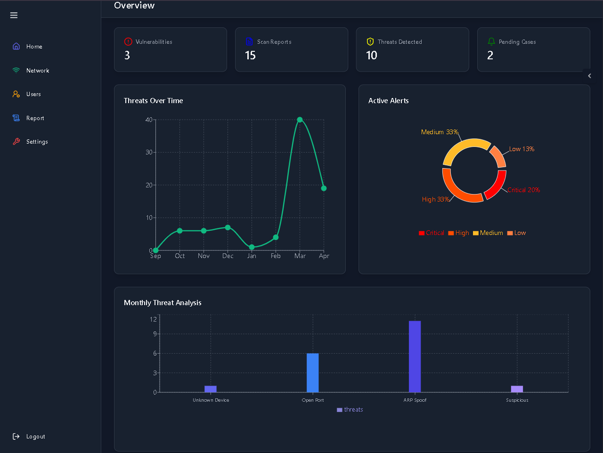

# SecureShield

SecureShield (formerly Pentest Pro) is a modular, web-based penetration testing framework designed to simplify and automate network security tasks such as port scanning, vulnerability detection, and reporting. Built with a user-friendly interface, it caters to both cybersecurity enthusiasts and professionals, offering features like device discovery, AI-driven report analysis, and customizable settings. The application uses MongoDB Atlas for cloud-based database management.

## Table of Contents

- Features
- System Requirements
- Installation
  - Ubuntu
  - Windows
- Environment Variables
- Python Modules
- Running the Application
- Creating the First User
- Usage Manual
  - Login Page
  - Dashboard
  - Network Page
  - Report Page
  - AI Analysis
  - Users Page
  - Settings Page
- Contributing
- License

## Features

- **Network Scanning**: Discover devices and perform port scans using Nmap integration.
- **Vulnerability Detection**: Identify potential security issues in networks and systems.
- **AI-Driven Analysis**: Summarize and provide actionable insights from security reports using Gemini API.
- **Modular Design**: Extensible architecture for adding new testing modules.
- **User Management**: Role-based access for admins and users.
- **Reporting**: Generate and export detailed security reports in PDF/CSV formats.
- **Real-Time Alerts**: Email notifications for high-severity issues via Gmail SMTP.
- **Secure Authentication**: JWT-based authentication for secure user access.

## System Requirements

- **Hardware**:
  - Processor: Dual-core 2.0 GHz or higher
  - RAM: 4 GB or more
  - Storage: Minimum 20 GB free disk space
  - Network: Active internet connection
- **Software**:
  - **Frontend**: Node.js (v16 or higher), npm
  - **Backend**: Python (v3.8 or higher), Node.js
  - **Tools**: Nmap (for scanning), Git
  - **Browsers**: Modern web browser (Chrome, Firefox, Edge)
  - **Cloud Services**: MongoDB Atlas account for database

## Installation

### Ubuntu

1. **Clone the Repository**:

   ```bash
   git clone https://github.com/abinrajmk8/SecureShield.git
   cd SecureShield
   ```

2. **Install Node.js and npm**:

   ```bash
   sudo apt update
   sudo apt install nodejs npm
   node -v  # Verify installation (should return v16 or higher)
   npm -v   # Verify installation
   ```

3. **Install Frontend Dependencies**:

   ```bash
   cd frontend
   npm install
   ```

4. **Install Backend Dependencies**:

   ```bash
   cd ../backend
   npm install
   ```

5. **Install Python**:

   ```bash
   sudo apt install python3 python3-pip
   python3 --version  # Verify installation
   ```

6. **Install Nmap**:

   ```bash
   sudo apt install nmap
   nmap --version  # Verify installation
   ```

### Windows

1. **Clone the Repository**:

   - Install Git for Windows: Download Git

   - Open Command Prompt or PowerShell:

     ```bash
     git clone https://github.com/abinrajmk8/SecureShield.git
     cd SecureShield
     ```

2. **Install Node.js and npm**:

   - Download and install from Node.js website

   - Verify:

     ```bash
     node -v
     npm -v
     ```

3. **Install Frontend Dependencies**:

   ```bash
   cd frontend
   npm install
   ```

4. **Install Backend Dependencies**:

   ```bash
   cd ../backend
   npm install
   ```

5. **Install Python**:

   - Download and install from Python website

   - Verify:

     ```bash
     python --version
     ```

6. **Install Nmap**:

   - Download and install from Nmap website

   - Verify (in Command Prompt):

     ```bash
     nmap --version
     ```

## Environment Variables

SecureShield requires a `.env` file in the `backend` directory to configure sensitive settings such as MongoDB Atlas connection, JWT secret, email service, and Gemini API key.

### Creating the `.env` File

1. Navigate to the `backend` directory:

   ```bash
   cd backend
   ```

2. Create a file named `.env` using a text editor (e.g., `nano`, `vim`, or Notepad):

   ```bash
   nano .env
   ```

3. Add the following environment variables, replacing placeholders with your actual credentials:

   ```
   MONGO_URI=mongodb+srv://<username>:<password>@<cluster>.mongodb.net/?retryWrites=true&w=majority&appName=<appName>
   PORT=3000
   JWT_SECRET=<your-secure-secret>
   PASS=<your-mongodb-password>
   EMAIL_USER=<your-email-address>
   EMAIL_PASS=<your-email-app-password>
   EMAIL_HOST=smtp.gmail.com
   EMAIL_PORT=587
   EMAIL_SECURE=false
   GEMINI_API_KEY=<your-gemini-api-key>
   ```

   - **MONGO_URI**: Your MongoDB Atlas connection string (e.g., `mongodb+srv://miniprojectaa07sakkdll:<password>@network.k0ddo.mongodb.net/...`).
   - **PORT**: Backend server port (default: 3000).
   - **JWT_SECRET**: A secure string for JWT authentication (e.g., `myverysecuresecret`).
   - **PASS**: MongoDB Atlas password (same as in MONGO_URI).
   - **EMAIL_USER**: Email address for sending alerts (e.g., `miniprojectaaa07s@gmail.com`).
   - **EMAIL_PASS**: App-specific password for the email service (e.g., Gmail app password).
   - **EMAIL_HOST**: SMTP server (e.g., `smtp.gmail.com` for Gmail).
   - **EMAIL_PORT**: SMTP port (e.g., `587` for TLS).
   - **EMAIL_SECURE**: Set to `false` for TLS (port 587) or `true` for SSL (port 465).
   - **GEMINI_API_KEY**: API key for Gemini AI integration (e.g., `AIzaSyBvwVahdjhejjkuSMalY09ruVgFG_9ysn3bot8_8mFY`).

4. Save and close the file (e.g., in `nano`, press `Ctrl+O`, `Enter`, then `Ctrl+X`).

5. Secure the `.env` file:

   - Ensure it’s not committed to Git by adding `.env` to `.gitignore`.

   - Restrict file permissions (Ubuntu):

     ```bash
     chmod 600 .env
     ```

**Note**: Keep your `.env` file confidential. Do not share sensitive credentials publicly.

## Python Modules

SecureShield uses the following Python modules:

- `socket`: For network communication
- `nmap`: Python wrapper for Nmap
- `os`: For system-level operations

### Example: Installing a Python Module

**Specific Example (nmap)**:

```bash
pip install python-nmap
```

Verify:

```bash
pip show python-nmap
```

**Generalized Example**:

```bash
pip install <module-name>
```

Verify:

```bash
pip show <module-name>
```

Replace `<module-name>` with the desired module (e.g., `requests`, `scapy`).

## Running the Application

1. **Start the Backend**:

   ```bash
   cd backend
   node server.js
   ```

   The backend runs on `http://localhost:3000` by default (or the port specified in `.env`).

2. **Start the Frontend**: Open a new terminal:

   ```bash
   cd frontend
   npm run dev
   ```

   The frontend runs on `http://localhost:3000` (check terminal for exact URL).

3. **Access the Application**: Open your browser and navigate to `http://localhost:3000`.

## Creating the First User

To create the first user for SecureShield:

1. Ensure the backend is running (`node server.js`).

2. Access the registration endpoint via a tool like Postman or `curl`:

   - URL: `http://localhost:3000/api/register`

   - Method: POST

   - Body (JSON):

     ```json
     {
       "name": "<your-name>",
       "username": "<your-username>",
       "password": "<your-password>",
       "role": "admin"
     }
     ```

   - Example:

     ```json
     {
       "name": "Admin User",
       "username": "admin",
       "password": "securepassword123",
       "role": "admin"
     }
     ```

3. Submit the request. The backend will:

   - Hash the password using bcrypt.
   - Generate a unique `companyId` using `uuid`.
   - Create the user in MongoDB Atlas.
   - Send a confirmation email to the registered email address.
   - Return a success message with the `companyId`.

4. Log in using the created credentials on the login page (`http://localhost:3000`).

**Example using** `curl`:

```bash
curl -X POST http://localhost:3000/api/register -H "Content-Type: application/json" -d '{"name":"Admin User","username":"admin","password":"securepassword123","role":"admin"}'
```

**Note**: The `role` field can be set to `admin` or `user`. The first user should typically be an admin for full access. Ensure the `EMAIL_USER` and `EMAIL_PASS` in the `.env` file are configured for email notifications.

## Usage Manual

### Login Page

- **Purpose**: Authenticate users with JWT-based login.
- **Features**:
  - Enter username and password
  - Option to recover forgotten passwords
  - Redirects to dashboard upon successful login
 


### Dashboard

- **Purpose**: Centralized hub for navigating SecureShield.
- **Features**:
  - Quick access to network scanning, reports, and settings
  - Displays recent activity and system status



### Network Page

- **Purpose**: Discover and scan network devices.
- **Features**:
  - Scan local network for devices (IP/MAC addresses)
  - Perform port scans to identify open ports and services
  - Filter devices by status or type


### Report Page

- **Purpose**: View and manage security reports.
- **Features**:
  - Generate detailed reports from scan results
  - Filter reports by severity or status
  - Export reports in PDF/CSV formats


### AI Analysis

- **Purpose**: Summarize and analyze security reports.
- **Features**:
  - AI-driven insights and actionable recommendations using Gemini API
  - Highlights critical vulnerabilities


### Users Page

- **Purpose**: Admin interface for user management.
- **Features**:
  - View, edit, or delete user accounts
  - Assign roles (admin/user)
  - Monitor user activity


### Settings Page

- **Purpose**: Configure system-wide settings.
- **Features**:
  - Enable/disable ARP spoofing detection
  - Set alert thresholds for notifications
  - Update account details


## Contributing

Contributions are welcome! To contribute:

1. Fork the repository
2. Create a new branch (`git checkout -b feature/your-feature`)
3. Commit your changes (`git commit -m "Add your feature"`)
4. Push to the branch (`git push origin feature/your-feature`)
5. Open a Pull Request

## License

This project is licensed under the MIT License. See the LICENSE file for details.


